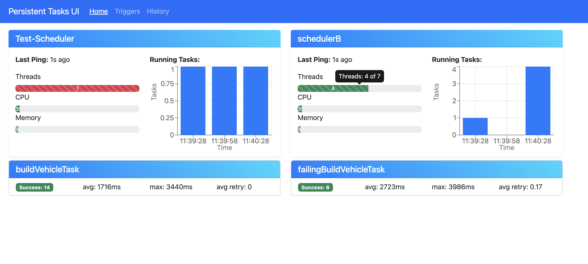
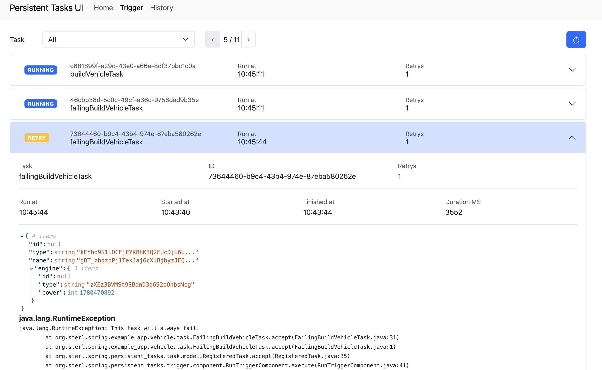
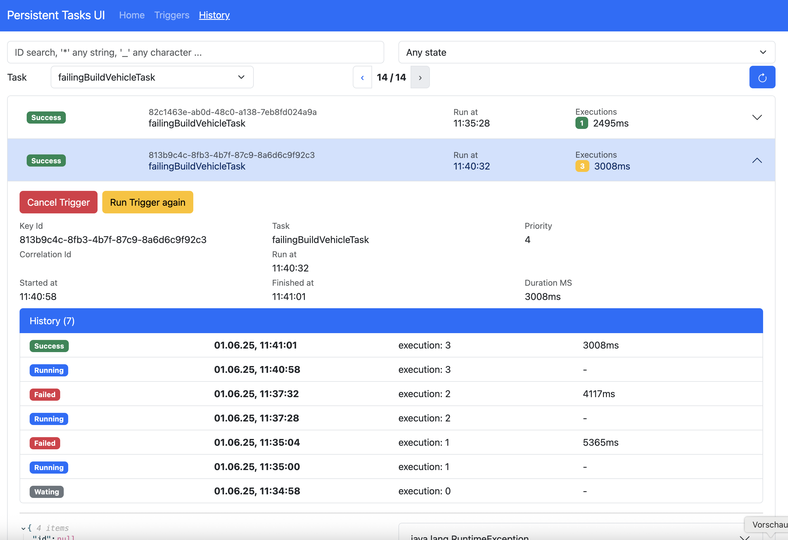

[](https://github.com/sterlp/spring-persistent-tasks/actions/workflows/build.yml)

# Spring Persistent Tasks

A simple task management framework designed to queue and execute asynchronous tasks with support for database persistence and a user-friendly interface. It can be used to implement scheduling patterns or outbound patterns.

Focus is the usage with spring boot and JPA.

Secondary goal is to support [Poor mans Workflow](https://github.com/sterlp/pmw)

# Setup and Run a Task

-   [JavaDoc](https://sterlp.github.io/spring-persistent-tasks/javadoc-core/org/sterl/spring/persistent_tasks/PersistentTaskService.html)

## Maven

-   [Maven Central spring-persistent-tasks-core](https://central.sonatype.com/artifact/org.sterl.spring/spring-persistent-tasks-core/versions)

```xml
<dependency>
    <groupId>org.sterl.spring</groupId>
    <artifactId>spring-persistent-tasks-core</artifactId>
    <version>1.x.x</version>
</dependency>
```

## Setup Spring

```java
@SpringBootApplication
@EnableSpringPersistentTasks
public class ExampleApplication {
```

## Setup a spring persistent task

### As a class

```java
@Component(BuildVehicleTask.NAME)
@RequiredArgsConstructor
@Slf4j
public class BuildVehicleTask implements SpringBeanTask<Vehicle> {

    private static final String NAME = "buildVehicleTask";
    public static final TaskId<Vehicle> ID = new TaskId<>(NAME);

    private final VehicleRepository vehicleRepository;

    @Transactional(timeout = 5)
    @Override
    public void accept(Vehicle vehicle) {
        // do stuff
        // save
        vehicleRepository.save(vehicle);
    }
}
```

### As a closure

Note: this example has no aspects as above the spring _@Transactional_

```java
@Bean
SpringBeanTask<Vehicle> task1(VehicleRepository vehicleRepository) {
    return v -> vehicleRepository.save(v);
}
```

## Queue a task execution

### Direct usage of the TriggerService.

```java
    private final TriggerService triggerService;

    public void buildVehicle() {
        // Vehicle has to be Serializable
        final var v = new Vehicle();
        // set any data to v ...

        // queue it
        triggerService.queue(BuildVehicleTask.ID.newUniqueTrigger(v));
    }
```

### Build Trigger

```java
    private final TriggerService triggerService;

    public void buildVehicle() {
       var trigger = TaskTriggerBuilder
                .<Vehicle>newTrigger("task2")
                .id("my-id") // will overwrite existing triggers
                .state(new Vehicle("funny"))
                .runAfter(Duration.ofHours(2))
                .build()

        triggerService.queue(trigger);
    }
```

### Use a Spring Event

```java
    private final TriggerService triggerService;

    public void buildVehicle() {
        // Vehicle has to be Serializable
        final var v = new Vehicle();
        // set any data
        triggerService.queue(BuildVehicleTask.ID.newUniqueTrigger(v));
    }
```

### Spring configuration options

| Property                                       | Type                 | Description                                                              | Default Value |
| ---------------------------------------------- | -------------------- | ------------------------------------------------------------------------ | ------------- |
| `spring.persistent-tasks.poll-rate`            | `java.lang.Integer`  | The interval at which the scheduler checks for new tasks, in seconds.    | -             |
| `spring.persistent-tasks.max-threads`          | `java.lang.Integer`  | The number of threads to use; set to 0 to disable task processing.       | `10`          |
| `spring.persistent-tasks.task-timeout`         | `java.time.Duration` | The maximum time allowed for a task and scheduler to complete a task.    | `5 minutes`   |
| `spring.persistent-tasks.poll-task-timeout`    | `java.lang.Integer`  | The interval at which the system checks for abandoned tasks, in seconds. | `5 minutes`   |
| `spring.persistent-tasks.history.delete-after` | `java.lang.Integer`  | The interval at which old triggers are deleted, in seconds.              | `72 hours`    |
| `spring.persistent-tasks.scheduler-enabled`    | `java.lang.Boolean`  | Indicates whether this node should handle triggers.                      | `true`        |

# Setup DB with Liquibase

Liquibase is supported. Either import all or just the required versions.

## Maven

-   [Maven Central spring-persistent-tasks-db](https://central.sonatype.com/artifact/org.sterl.spring/spring-persistent-tasks-db/versions)

## Option 1: Just include the master file

```xml
<include file="spring-persistent-tasks/db.changelog-master.xml" />
```

## Option 2: import changesets on by one

```xml
<include file="spring-persistent-tasks/db/pt-changelog-v1.xml" />
```

# Setup UI

## Maven

-   [Maven Central spring-persistent-tasks-ui](https://central.sonatype.com/artifact/org.sterl.spring/spring-persistent-tasks-ui/versions)

```xml
<dependency>
    <groupId>org.sterl.spring</groupId>
    <artifactId>spring-persistent-tasks-ui</artifactId>
    <version>1.x.x</version>
</dependency>
```

## Setup Spring

```java
@SpringBootApplication
@EnableSpringPersistentTasks
@EnableSpringPersistentTasksUI
public class ExampleApplication {
```

## Open the UI

-   http://localhost:8080/task-ui

## Schedulers



## Triggers



## History



# Alternatives

-   quartz
-   db-scheduler
-   jobrunr
