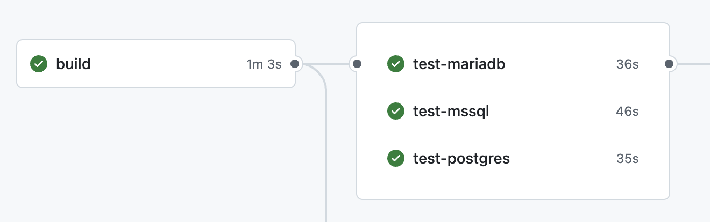

[](https://github.com/sterlp/spring-persistent-tasks/actions/workflows/build.yml)
[](https://spring.io/projects/spring-boot)
[](LICENSE)

# Spring Persistent Tasks

A simple task management framework designed to queue and execute asynchronous tasks with support for database persistence and a user-friendly interface. It can be used to implement scheduling patterns or outbound patterns.

Focus is the usage with spring boot and JPA.

Secondary goal is to support [Poor mans Workflow](https://github.com/sterlp/pmw)

# Key Features ✨
1. **JPA-Powered Persistence** - Automatically persists tasks to your database
1. **Spring Boot Auto-Configuration** - Simple setup with @EnableSpringPersistentTasks
1. **Clustering Support** - Built-in lock management for distributed environments
1. **Type-Safe Tasks** - Generic task definitions with state objects
1. **Retry Mechanisms** - Automatic retry policies for failed executions
1. **Transactional Integration** - Works with Spring's transaction management
1. **Queue Management** - Intelligent task queuing and prioritization
1. **Different DB Supports** -- 

# Documentation

Use for more advanced doc the [WIKI](https://github.com/sterlp/spring-persistent-tasks/wiki).
The README contains a shorter how to use.

# Known issues

- spring-boot-devtools: cause java.lang.ClassCastException exceptions during the state serialization - this is a java/spring issue

# DBs for storage

## Tested in the pipeline

- [](https://www.h2database.com)
- [](https://azure.microsoft.com/en-us/products/azure-sql/edge/)
- [](https://www.postgresql.org)
- [](https://mariadb.org)



## Supported in theory

-   MSSQL, as azure-sql-edge is tested

## Not supported

-   mySQL: sequences are not supported

# JavaDoc

-   [JavaDoc](https://sterlp.github.io/spring-persistent-tasks/javadoc-core/org/sterl/spring/persistent_tasks/PersistentTaskService.html)

# Quickstart

-   [Maven Central spring-persistent-tasks-core](https://central.sonatype.com/artifact/org.sterl.spring/spring-persistent-tasks-core/versions)

## Setup with Maven


```xml
<dependency>
    <groupId>org.sterl.spring</groupId>
    <artifactId>spring-persistent-tasks-core</artifactId>
    <version>1.x.x</version>
</dependency>
```

## Setup Spring

```java
@SpringBootApplication
@EnableSpringPersistentTasks
public class ExampleApplication {
```

## Create a Task

```java
@Bean
PersistentTask<Vehicle> task1(VehicleHttpConnector vehicleHttpConnector) {
    return v -> vehicleHttpConnector.send(v);
}
```

## Trigger a task

```java
@Autowired
PersistentTaskService persistentTaskService;

public void triggerTask1(Vehicle vehicle) {
    persistentTaskService.runOrQueue(
        TriggerBuilder.newTrigger("task1").state(vehicle).build());
}
```

### JUnit Tests

- [Persistent Task and Testing](https://github.com/sterlp/spring-persistent-tasks/wiki/Triggers-and-Tasks-in-JUnit-Tests)

# Setup DB with Liquibase

Liquibase is supported. Either import all or just the required versions.

## Maven

-   [Maven Central spring-persistent-tasks-db](https://central.sonatype.com/artifact/org.sterl.spring/spring-persistent-tasks-db/versions)

## Option 1: Just include the master file

```xml
<include file="spring-persistent-tasks/db.changelog-master.xml" />
```

## Option 2: import changesets on by one

```xml
<include file="spring-persistent-tasks/db/pt-changelog-v1.xml" />
```

# Setup UI

## Maven

-   [Maven Central spring-persistent-tasks-ui](https://central.sonatype.com/artifact/org.sterl.spring/spring-persistent-tasks-ui/versions)

```xml
<dependency>
    <groupId>org.sterl.spring</groupId>
    <artifactId>spring-persistent-tasks-ui</artifactId>
    <version>1.x.x</version>
</dependency>
```

## Setup Spring

```java
@SpringBootApplication
@EnableSpringPersistentTasks
@EnableSpringPersistentTasksUI
public class ExampleApplication {
```

## Open the UI

-   http://localhost:8080/task-ui

## Schedulers


## Triggers


## History


# Alternatives

-   quartz
-   db-scheduler
-   jobrunr
