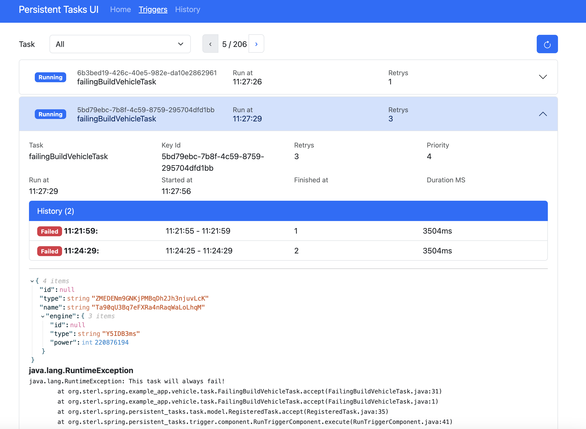

# Spring Persistent Tasks

A simple task management framework designed to queue and execute asynchronous tasks with support for database persistence and a user-friendly interface. It can be used to implement scheduling patterns or outbound patterns.

Focus is the usage with spring boot and JPA.

Secondary goal is to support [Poor mans Workflow](https://github.com/sterlp/pmw)

# Setup and Run a Task

## Maven

```xml
<dependency>
    <groupId>org.sterl.spring</groupId>
    <artifactId>spring-persistent-tasks-core</artifactId>
    <version>1.x.x</version>
</dependency>
```

## Setup Spring

```java
@SpringBootApplication
@EnableSpringPersistentTasks
public class ExampleApplication {
```

## Setup a spring persitent task

### As a class
```java
@Component(BuildVehicleTask.NAME)
@RequiredArgsConstructor
@Slf4j
public class BuildVehicleTask implements SpringBeanTask<Vehicle> {

    private static final String NAME = "buildVehicleTask";
    public static final TaskId<Vehicle> ID = new TaskId<>(NAME);
    
    private final VehicleRepository vehicleRepository;

    @Transactional(timeout = 5)
    @Override
    public void accept(Vehicle vehicle) {
        // do stuff
        // save
        vehicleRepository.save(vehicle);
    }
}
```

### As a closure

Note: this example has no aspects as above the spring *@Transactional*

```java
@Bean
SpringBeanTask<Vehicle> task1(VehicleRepository vehicleRepository) {
    return v -> vehicleRepository.save(v);
}
```

## Queue a task execution

### Direct usage of the TriggerService.

```java
    private final TriggerService triggerService;

    public void buildVehicle() {
        // Vehicle has to be Serializable
        final var v = new Vehicle();
        // set any data to v ...

        // queue it
        triggerService.queue(BuildVehicleTask.ID.newUniqueTrigger(v));
    }
```

### Build Trigger
```java
    private final TriggerService triggerService;

    public void buildVehicle() {
       var trigger = TaskTriggerBuilder
                .<Vehicle>newTrigger("task2")
                .id("my-id") // will overwrite existing triggers
                .state(new Vehicle("funny"))
                .runAfter(Duration.ofHours(2))
                .build()

        triggerService.queue(trigger);
    }
```

### Use a Spring Event

```java
    private final TriggerService triggerService;

    public void buildVehicle() {
        // Vehicle has to be Serializable
        final var v = new Vehicle();
        // set any data
        triggerService.queue(BuildVehicleTask.ID.newUniqueTrigger(v));
    }
```

# Setup DB

Liquibase is supported. Either import all or just the required versions:

## Option 1: Just include the master file
```xml
<include file="spring-persistent-tasks/db.changelog-master.xml" />
```
## Option 2: import changesets on by one
```xml
<include file="spring-persistent-tasks/db/pt-changelog-v1.xml" />
```

# Setup UI

## Maven

```xml
<dependency>
    <groupId>org.sterl.spring</groupId>
    <artifactId>spring-persistent-tasks-ui</artifactId>
    <version>1.x.x</version>
</dependency>
```

## Setup Spring

```java
@SpringBootApplication
@EnableSpringPersistentTasks
@EnableSpringPersistentTasksUI
public class ExampleApplication {
```

## Open the UI

- http://localhost:8080/task-ui

## Schedulers


## Triggers


## History


# Alternatives

- quartz
- db-scheduler
- jobrunr