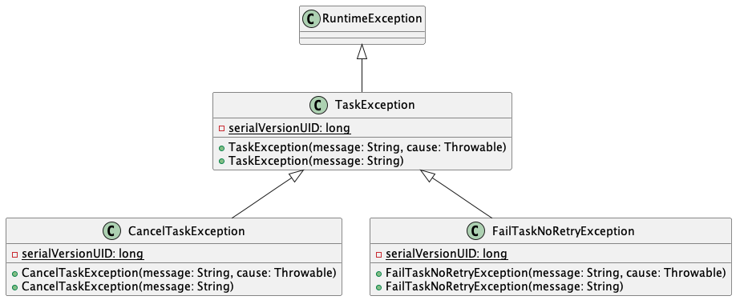

# Cancel a trigger

## Cancel a queued trigger

In general any trigger/task which is not running can be canceled. As soon it is in the running state it cannot be canceled anymore.

```java
@Test
void testCancelTrigger() {
    // GIVEN
    var key1 = subject.queue(taskId.newTrigger().build()).getKey();

    // WHEN
    final var canceled = subject.cancel(key1);

    // THEN
    assertThat(canceled).isPresent();
    assertThat(canceled.get().getKey()).isEqualTo(key1);
}
```

## Cancel a running trigger

As soon a task is triggered, a task may decide to cancel or to fail itself. Both will suppress any outstanding retries of the retry strategy.
{ align=center }

```java
@Test
void tesCancelRunningTrigger() {
    // GIVEN
    TaskId<String> taskId = taskService.replace("foo-cancel", c -> {
        throw new CancelTaskException(c);
    });
    var key1 = subject.queue(taskId.newTrigger().build()).getKey();

    // WHEN
    assertThat(runNextTrigger()).isPresent();

    // THEN
    assertThat(historyService.findLastKnownStatus(key1).get().status()).isEqualTo(TriggerStatus.CANCELED);

    // AND
    assertThat(events.stream(TriggerCanceledEvent.class).count()).isOne();
}
```

## Fail a running trigger example

```java
@Test
void tesFailRunningTriggerNoRetry() {
    // GIVEN
    TaskId<String> taskId = taskService.replace("foo-fail", c -> {
        throw new FailTaskNoRetryException(c);
    });
    var key1 = subject.queue(taskId.newTrigger().build()).getKey();

    // WHEN
    assertThat(runNextTrigger()).isPresent();

    // THEN
    assertThat(historyService.findLastKnownStatus(key1).get().status()).isEqualTo(TriggerStatus.FAILED);

    // AND
    assertThat(events.stream(TriggerFailedEvent.class).count()).isOne();
}
```
